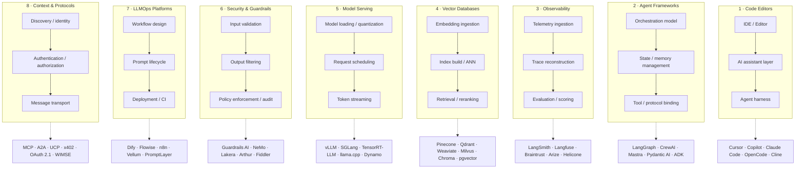
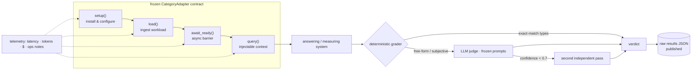

# Architecture of the AI Infrastructure Stack

How the AI infrastructure landscape is shaped, and how the Quest tests it.

## The eight layers

Every tool on the roster, whatever its marketing, resolves to one of eight architectural layers — plus the protocol layer that cuts across them all:

**Protocol layer** — MCP, A2A, UCP, x402, OpenTelemetry GenAI conventions — cuts across all eight layers, providing the connective tissue that lets tools interoperate.

## The four write-path shapes (for stateful layers)

Within the stateful layers (memory, vector DB, observability, LLMOps), every tool resolves to one of four write-path designs:

| Shape | Description | Examples |
|-------|-------------|----------|
| **Fact extractors** | LLM extracts salient facts → reconcile → vector store | Mem0, Memori |
| **Graph builders** | LLM extracts entities + relations → temporal edges → graph DB | Graphiti, Cognee |
| **Profile / user-modelers** | LLM updates structured profile → profile + event log | Memobase, Honcho |
| **OS-style managers** | Agent loop manages its own memory → core ↔ archival store | Letta, MemOS |

## How the Quest tests a category

Same harness philosophy for all eight categories: the judge was frozen before any tool ran.

The `await_ready()` barrier is where async-ingestion designs (graph extraction, cognify, deriver queues, re-encodes) get their cost measured instead of hidden.

## Current landscape readings

- **Code editors**: Terminal-native agents are the fastest-growing subcategory; 60%+ of devs use AI coding daily.
- **Agent frameworks**: Consolidated to ~8 serious production options; TypeScript (Mastra) and Rust (Rig, OpenFANG) now have first-class frameworks.
- **Observability**: OpenTelemetry GenAI conventions are the converging standard; Langfuse acquired by ClickHouse; Braintrust raised $80M Series B.
- **Vector DBs**: Postgres vs. dedicated DB is the central fork; parser quality is the #1 RAG bottleneck.
- **Model serving**: vLLM + SGLang + TensorRT-LLM dominate; NVIDIA Dynamo 1.0 replaces Triton for LLMs; K8s-native serving is the production default.
- **Security**: $3.43B TRiSM market; 20+ startups raised $560M; major consolidation (Check Point/Lakera, Palo Alto/Protect AI).
- **LLMOps**: Dify at 142K stars; evaluation-first development replaced "ship and pray"; 73% of enterprises require agent monitoring.
- **Protocols**: MCP is the undisputed agent-to-tool standard (97M monthly downloads); A2A converging for agent-to-agent; security is the critical gap (100% of scanned MCP servers lacked authentication).
